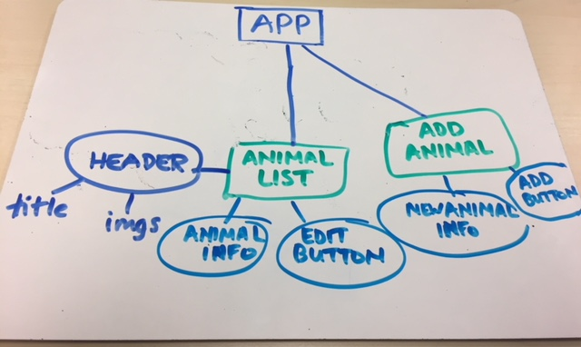
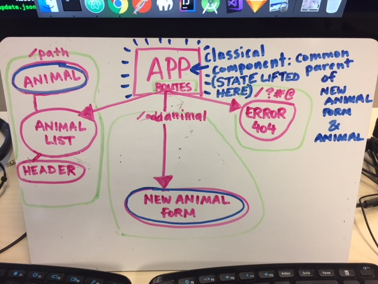

## React Week 1 Solo Project: Convert an Angular2 app to React

## Project to be converted: Local Zoo

#### February 9, 2018 & February 16, 2018

### Cat Janowitz

###  Installation
```
in terminal:
* npm install webpack webpack-dev-server eslint eslint-plugin-react -g

* clone this repository
* npm init
* npm install
* npm run start
```
### React Component structure (2/9/18):
Component structure will differ between an Angular2-based design and a React library-based design. Below is a component tree I designed for Local Zoo with React retrofitting in mind:

After reading the "Thinking in React" article (image below) and going through the curriculum I know that React is component-based, and most components are essentially a pure function (React uses functional programming). React organizes the app around the actions it performs; components are designed around the 'single responsibility principle': ideally, components are responsible for doing one thing!


###  Notes on Angular2 vs React (2/9/18):

#### Unforeseen issues and questions I encountered during development process:

This is how my component tree looks after designing the Local Zoo app with React:



'Animal List' component is now acting as the main 'body/home' component that houses the 'Header' component. I'm keeping in mind that each component has one action and is responsible for the props passed to them. This wasn't necessarily an issue with this project, and I went in hoping that my initial tree design would hold up.

#### UPDATE (2/16/18):
Upon re-visiting the React retrofit for this app I learned about stateful components and lifting state to the common parent component, in this case the App component. This app is designed using application state--where the data is not contained and must be shared with other components (in this case the 'add animal' and the 'animal' components). State needs to come from one true single source and instances of that state must live above those components that use it.

Additionally, the previous component tree was less based on data and instead based (erroneously) on routing. At the time I converted the app to React I was still dealing with static data.

Here is the updated component tree that accurately respresents the state and how it relates to other components within the app:



#### My thoughts on the differences in development between Angular and React (2/9/28):

Before starting this project I feel like Angular2 was much less intuitive compared to React. Connecting components in Angular and passing data from one to another was very "ball o yarn" -esque while React remains less so. This week's projects involved creating components that were self-contained (the CSS objects lived with the component functions that returned elements as values).

As far as dynamic data is concerned, making a UI interactive relies on state in React. Since we're still dealing with static data our current set-up has limitations and cannot process and render changing data.  With reference to the 'Thinking in React' article, we are not yet dealing with text a user has entered in a form (which is state) or the value of a checkbox (also state) for filtering displayed data.


Copyright (c) 2018 **Cat Janowitz**
