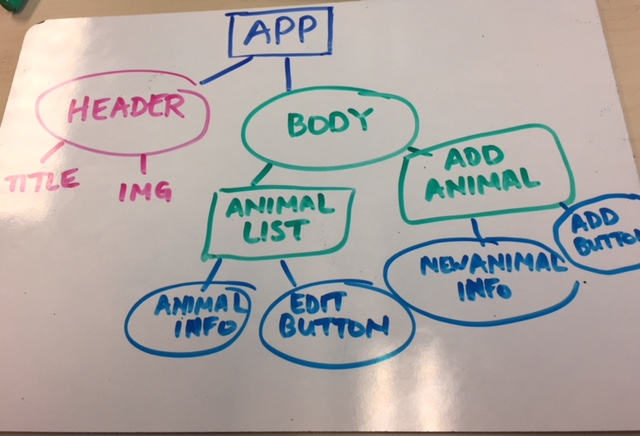
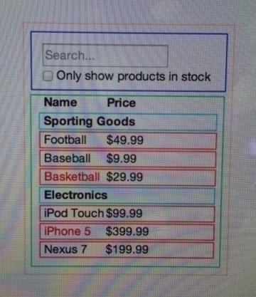

## React Week 1 Solo Project: Convert an Angular2 app to React

## Project to be converted: Local Zoo

#### February 9, 2018

### Cat Janowitz

###  Description
#### React Component structure
Component structure will differ between an Angular2-based design and a React library-based design. Below is a component tree I designed for Local Zoo with React retrofitting in mind:

After reading the "Thinking in React" article (image below) and going through the curriculum I know that React is component-based, and most components are essentially a pure function (aka functional programming). React organizes the app around the actions it performs; components are designed around the 'single responsibility principle': ideally, components are responsible for doing one thing!

###  Notes on Angular2 vs React:

* Unforeseen issues and questions I encountered during development process:

''

* My thoughts on the differences in development between Angular and React:

Before starting this project I feel like Angular2 was much less intuitive compared to React. Connecting components in Angular and passing data from one to another was very "ball o yarn" -esque while React remains less so. So far.  It helps that this week our components were developed and designed within the component file itself (the CSS objects lived with the component functions that returned elements as values).

Copyright (c) 2018 **Cat Janowitz**
